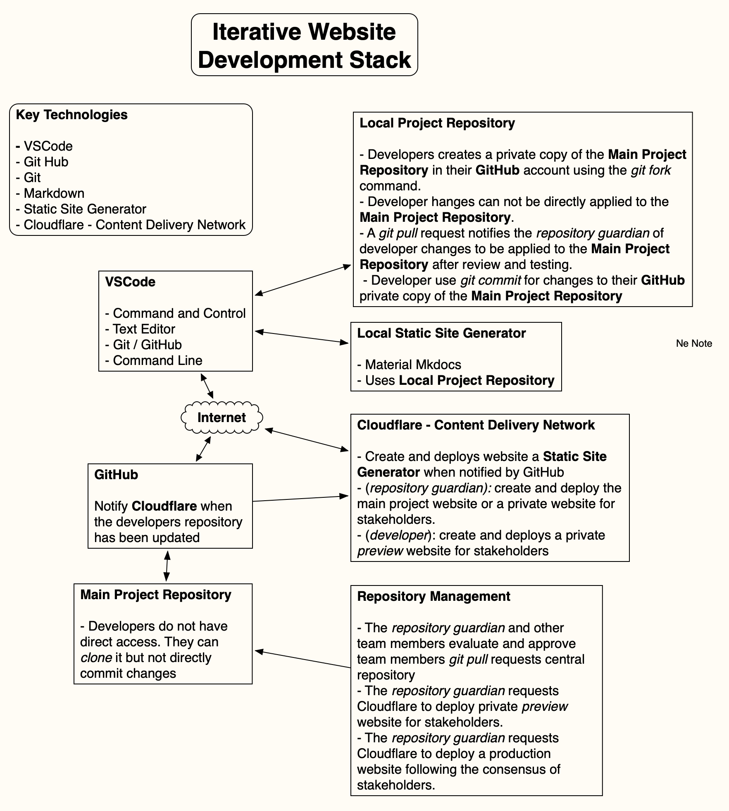

# Iterative Website Development

??? abstract "Purpose"
    The purpose of Iterative Website Development is to minimize website projects life time costs

<figure markdown>
  {width="800"}
  <figcaption>Iterative Website Development Stack</figurecaption>
</figure>

# Key Technologies

## VSCode

Command and Control

Text Editor

Git / GitHub

Command Line

## Local Project Repository

Developers creates a private copy of the Main Project Repository in their GitHub 
account using the `git fork` command.

Developer use `git commit` for changes to their private copy of the Main Project Repository

Developer changes can not be directly committed to the Main Project Repository. They use the `git pull` command to request the Repository Guardian add the changes to the Main Project Repository after review and testing.

## Markdown

## Local Static Site Generator

Developers use the local Static Generator built-into Material for development or a private website for stakeholders

Developers  Local Project Repository

The
## GitHub

Notify The Content Delivery Network when a Developers or  the Repository Guardian repository has been updated

## Content Delivery Network

Create and deploys website using a Static Site Generator when notified by GitHub

The Repository Guardian create and deploy the main project website or a private website for stakeholders.

Developers create and deploys a private preview website for stakeholders

## Main Project Repository

Developers do not have direct access. They can clone it but not directly commit changes

## Repository Management

The Repository Guardian and other team members evaluate and approve team members git pull requests central repository

The Repository Guardian requests Content Delivery Network to deploy private preview website for stakeholders.

The Repository Guardian requests Content Delivery Network to deploy a production website following the consensus of stakeholders

---

- Iterative website development is done by different [Teams](../team_overview.md) with different responsibilities and skills.
 
- The Define, Design, Develop, Deploy and Maintenance team members create, test and [Remediating Defects](defect_remediation_cost.md)​. All team members may be operational at the same time without interfering with each other, or the production website, during the lifetime of the website

- Each team member frequently deploys their work to a private [Preview](preview.md) internet website for stakeholders to quickly view and give feedback 

??? Danger "Defects"
	The slightest configuration, programming or security defect issues during the project will require Remediating and increasing overall lifetime costs 
	
